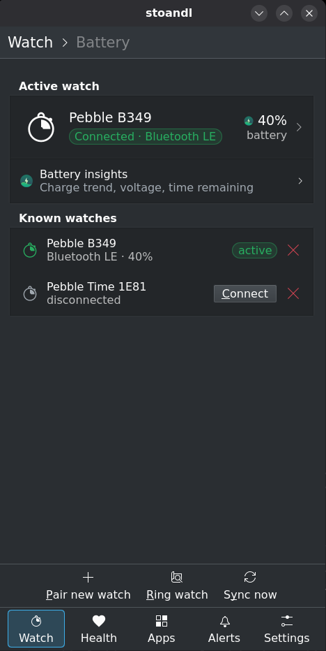
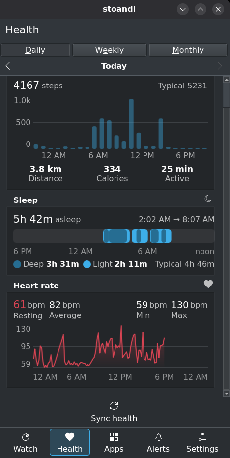
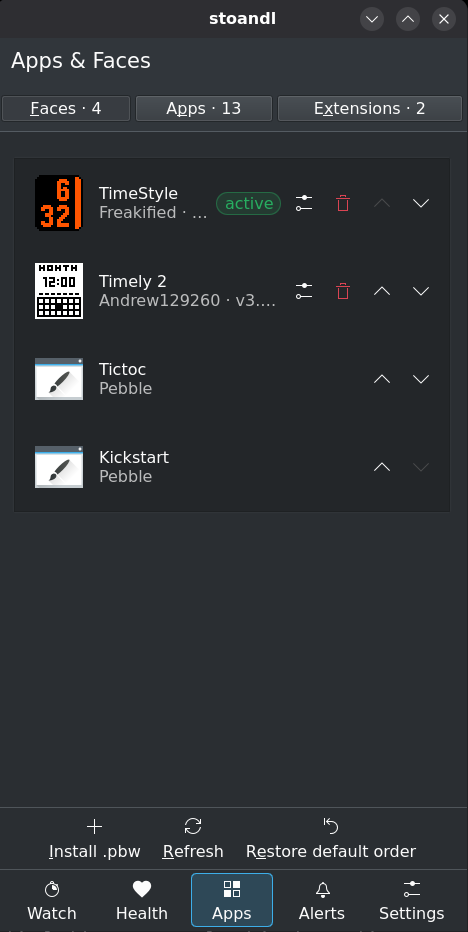
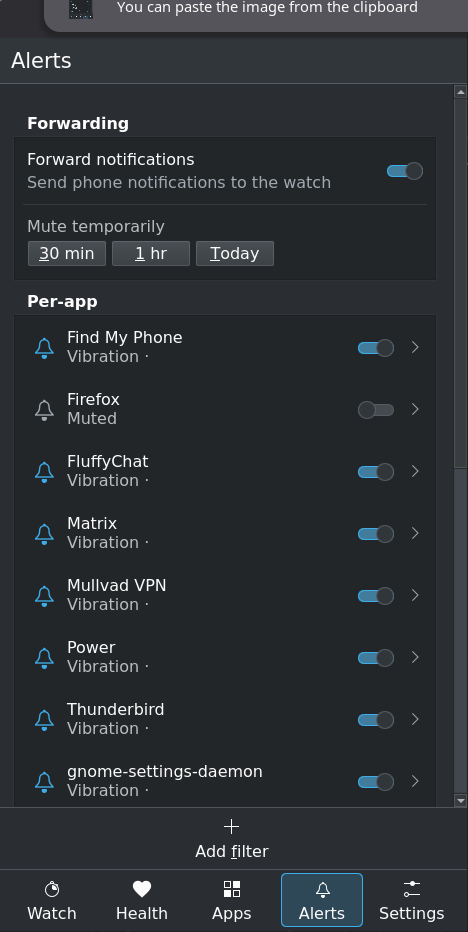
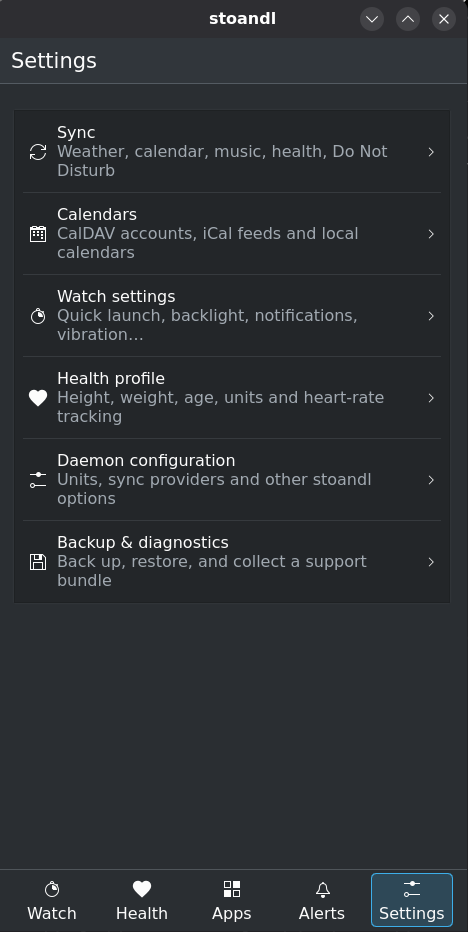
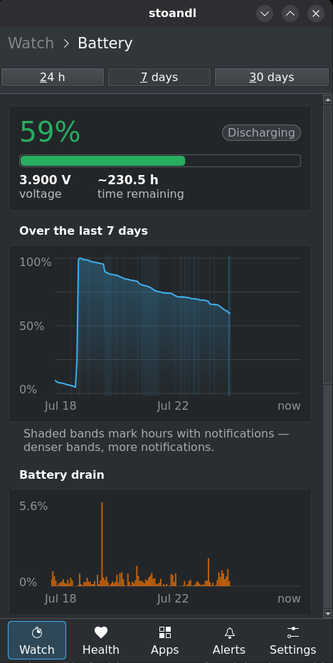

<p align="center"></p>

# stoandl-gui

Desktop / mobile front-end for the **stoandl** Pebble companion daemon. Convergent:
Plasma Mobile + phosh + desktop.

There are **two front-ends** of the same app, built from one repo and packaged
independently so they install and run **side by side** — pick whichever fits your
desktop, or run both to compare:

| Variant | Toolkit | Directory | App id | Binary | Launcher name |
|---|---|---|---|---|---|
| **Kirigami** | Qt 6 / QML (KDE) | `kirigami/` | `de.yoxcu.stoandl.gui` | `stoandl-gui` | stoandl |
| **GTK** | GTK 4 / libadwaita | `gtk/` | `de.yoxcu.stoandl.gui.gtk` | `stoandl-gui-gtk` | stoandl (GTK) |

Both speak the same `de.yoxcu.stoandl.Control` D-Bus contract (session bus, path
`/de/yoxcu/stoandl`) and are thin clients of the (separately installed) daemon —
no code is shared with it. Full contract: `docs/dbus-interface.md`.

## Layout

```
kirigami/    Qt/QML front-end (CMakeLists.txt, src/, qml/)
gtk/         GTK/Rust front-end (Cargo.toml, src/, ui/, resources/, build.rs)
data/        SHARED desktop integration — per-variant .desktop / .metainfo /
             flatpak manifest, and the hicolor icon tree (de.yoxcu.stoandl.gui.*
             for Kirigami, de.yoxcu.stoandl.gui.gtk.* for GTK)
packaging/   per-variant APKBUILD (kirigami/, gtk/) + the shared signing key (keys/)
.github/     CI: one matrixed workflow builds both flatpaks and both apks
tools/       shared mock daemon + a run-with-mock launcher per variant
```

## Screenshots

<table>
  <tr>
    <td align="center" width="33%"><br><sub><b>Watch</b> — pairing, firmware, battery</sub></td>
    <td align="center" width="33%"><br><sub><b>Health</b> — steps, sleep, heart rate</sub></td>
    <td align="center" width="33%"><br><sub><b>Apps</b> — faces, apps, extensions</sub></td>
  </tr>
  <tr>
    <td align="center" width="33%"><br><sub><b>Alerts</b> — per-app mute, filters</sub></td>
    <td align="center" width="33%"><br><sub><b>Settings</b> — sync, calendars, config</sub></td>
    <td align="center" width="33%"><br><sub><b>Battery insights</b> — charge, drain, power</sub></td>
  </tr>
</table>

## Build

**Kirigami** — Qt6 (Core/Gui/Widgets/Qml/Quick/DBus) plus the Kirigami and
KirigamiAddons **runtime QML modules** and a QtQuick Controls style
(`qqc2-desktop-style`):

```sh
cmake -S kirigami -B build -G Ninja
cmake --build build            # → ./build/stoandl-gui
```

**GTK** — a Rust toolchain plus GTK 4 / libadwaita dev packages and
`blueprint-compiler` (used by `gtk/build.rs`):

```sh
cargo build --manifest-path gtk/Cargo.toml   # → gtk/target/debug/stoandl-gui-gtk
```

In this dev container the Qt / GTK deps are installed via `.container/Dockerfile` —
rebuild/restart the container first. Desktop integration (`.desktop` launcher,
AppStream metainfo, hicolor icon theme) lives in `data/` and installs to `<datadir>`;
see `data/README.md`.

## Run

The daemon is **not** D-Bus-activated; start it first (or let the in-app button do it):

```sh
systemctl --user start stoandl     # optional — both GUIs offer this too
./build/stoandl-gui                # Kirigami
./gtk/target/debug/stoandl-gui-gtk # GTK
```

Headless smoke test (no live UI): `QT_QPA_PLATFORM=offscreen ./build/stoandl-gui` for
Kirigami; `tools/run-with-mock-gtk.sh --headless` for GTK (runs it under a throwaway
headless weston).

## Testing without the real daemon (mock)

`tools/mock_stoandl.py` is a stateful stand-in for `de.yoxcu.stoandl.Control` that
implements the **full surface both GUIs use**. There is one launcher per variant; each
spins up an ephemeral session bus, starts the mock on it, then launches its GUI:

```sh
tools/run-with-mock.sh                            # Kirigami (desktop)
QT_QPA_PLATFORM=offscreen tools/run-with-mock.sh  # Kirigami headless smoke test
tools/run-with-mock-gtk.sh                         # GTK (needs Wayland)
tools/run-with-mock-gtk.sh --headless              # GTK headless smoke test
tools/run-with-mock.sh --mock-only                 # just the mock (Ctrl-C to stop)
```

Requires `dbus`, `python3-dbus`, `python3-gi` (installed via `.container/Dockerfile`).

## Releases

CI is `.github/workflows/release.yml`, a single **matrixed** workflow that builds
**both variants**: the Flatpaks build on every push/PR (the CI gate — stock Ubuntu's
Qt/GTK is too old to build natively), and pushing a `v*` tag publishes a GitHub
Release with:

- **two `.flatpak` bundles** — `de.yoxcu.stoandl.gui.flatpak` (KDE runtime) and
  `de.yoxcu.stoandl.gui.gtk.flatpak` (GNOME runtime),
- **two aarch64 pmOS `.apk`s** — `stoandl-gui` and `stoandl-gui-gtk`,
- one **source tarball** (`stoandl-gui-<ver>.tar.gz`) that feeds both
  `packaging/*/APKBUILD`, and
- an auto-generated changelog (`cliff.toml`, from Conventional Commit messages).

Because the two variants have distinct app ids, binaries and package names, you can
install both at once.

### Installing the postmarketOS `.apk`s

A tagged release also ships the public signing key (`mick@yoxcu.de-*.rsa.pub`). Trust
it once and `apk add` installs — and every future release — without `--allow-untrusted`:

```sh
# from the release page, download the .apk(s) and the matching .rsa.pub, then:
doas cp mick@yoxcu.de-*.rsa.pub /etc/apk/keys/   # trust the signing key (once)
doas apk add ./stoandl-gui-*.apk                 # Kirigami
doas apk add ./stoandl-gui-gtk-*.apk             # GTK (installs alongside)
```

(Or skip the key with `doas apk add --allow-untrusted ./...apk`.)

### Installing / testing a Flatpak build

A `.flatpak` bundle isn't runnable directly — you `flatpak install` it first (a fast
import, not a rebuild):

```sh
# grab a bundle: a CI build artifact (any push) …
gh run download -R yoxcu/stoandl-gui -n flatpak-bundle-kirigami   # or -gtk
# … or a tagged release asset
gh release download -R yoxcu/stoandl-gui -p '*.flatpak'

flatpak remote-add --if-not-exists --user flathub https://flathub.org/repo/flathub.flatpakrepo
flatpak install --user de.yoxcu.stoandl.gui.flatpak      # Kirigami (org.kde.Platform)
flatpak install --user de.yoxcu.stoandl.gui.gtk.flatpak  # GTK (org.gnome.Platform)
flatpak run de.yoxcu.stoandl.gui       # or: flatpak run de.yoxcu.stoandl.gui.gtk
```

Start the daemon on the host first (`systemctl --user start stoandl`) — the sandboxed
GUI reaches it over the session bus. Sandbox limits: backup/restore/support (which
shell out to the `stoandl` CLI) and the in-app "start daemon" button don't work inside
the Flatpak; the D-Bus features do. **For day-to-day development, skip the Flatpak** and
build + run natively.
